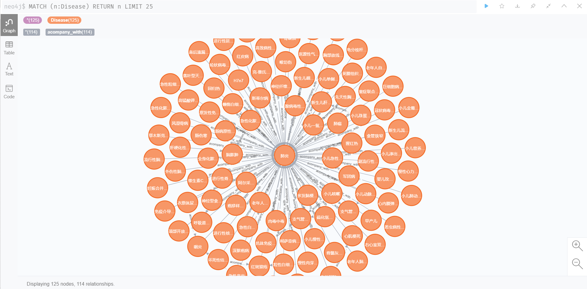
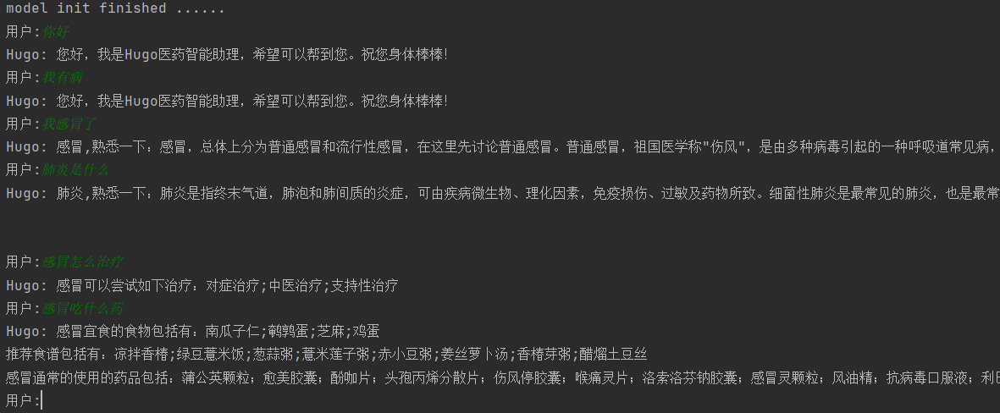

# 医药问答系统

本项目是一个基于python和neo4j图数据库的医药类知识图谱问答系统。fork自https://github.com/liuhuanyong/QASystemOnMedicalKG

## 运行环境说明
本项目在以下环境中进行过测试：
```
系统：window 10
python版本：python 3.8
IDE：PyCharm
数据库：neo4j
```
```
系统：Ubuntu 20.04LTS - WSL2
python版本：python 3.8
数据库：neo4j
```
所需依赖
```
ahocorasick 1.4.2 (python中包名为pyahocorasick)
py2neo 2021.1.5 (py2neo旧版本可能导致neo4j连接失败)
```
## 运行方式
1、下载neo4j相关组件，新建数据库，修改```build_medicalgraph.py```和```answer_search.py```中以下语句的账号密码（初始账号和密码均为neo4j）；
```
self.g = Graph("http://localhost:7474", auth=("neo4j","123456"))
```

2、运行程序```build_medicalgraph.py```, 构建图数据库

注：原始数据保存在```data/medical.json```中，构建时若是使用原始数据则这一步耗时为几个小时，可以使用从原始数据中截取的部分数据```data_medical1.json```，耗时几分钟。更改```build_medicalgraph.py```中的以下语句即可更改数据源：
```
self.data_path = os.path.join(cur_dir, 'data/medical.json')
```

3、运行主程序```chat_graph.py```

## 项目说明
### 项目结构图
```
C:.
│  answer_search.py 
│  build_medicalgraph.py
│  chatbot_graph.py
│  question_classifier.py
│  question_parser.py
│  README.md
│
└─data
        medical.json
        medical1.json
```
```build_medicalgraph.py``` 连接数据库，构建知识图谱

```question_parser.py``` 构建实体节点，解析主函数

```question_classifier.py``` 构建特征词词典

```answer_search.py``` 执行查询，调用相应模板

```chatbot_graph.py``` 主程序

程序结构图：


### 数据处理
原始数据格式为```json```格式，数据样式如下：


使用python内置的json包来读取json文件

### 构建知识图谱

创建节点
```
'''建立节点'''
 def create_node(self, label, nodes):
        count = 0
        for node_name in nodes:
            node = Node(label, name=node_name)
            self.g.create(node)
            count += 1
            print(count, len(nodes))
        return

 '''创建知识图谱中心疾病的节点'''
def create_diseases_nodes(self, disease_infos):
    count = 0
    for disease_dict in disease_infos:
        node = Node("Disease", name=disease_dict['name'], desc=disease_dict['desc'],
                    prevent=disease_dict['prevent'] ,cause=disease_dict['cause'],
                    easy_get=disease_dict['easy_get'],cure_lasttime=disease_dict['cure_lasttime'],
                    cure_department=disease_dict['cure_department']
                    ,cure_way=disease_dict['cure_way'] , cured_prob=disease_dict['cured_prob'])
        self.g.create(node)
        count += 1
        print(count)
    return

'''创建知识图谱实体节点类型schema'''
def create_graphnodes(self):
    Drugs, Foods, Checks, Departments, Producers, Symptoms, Diseases, disease_infos,rels_check, rels_recommandeat, rels_noteat, rels_doeat, rels_department, rels_commonddrug, rels_drug_producer, rels_recommanddrug,rels_symptom, rels_acompany, rels_category = self.read_nodes()
    self.create_diseases_nodes(disease_infos)
    self.create_node('Drug', Drugs)
    print(len(Drugs))
    self.create_node('Food', Foods)
    print(len(Foods))
    self.create_node('Check', Checks)
    print(len(Checks))
    self.create_node('Department', Departments)
    print(len(Departments))
    self.create_node('Producer', Producers)
    print(len(Producers))
    self.create_node('Symptom', Symptoms)
    return
```

创建边
```
'''创建实体关联边'''
    def create_relationship(self, start_node, end_node, edges, rel_type, rel_name):
        count = 0
        # 去重处理
        set_edges = []
        for edge in edges:
            set_edges.append('###'.join(edge))
        all = len(set(set_edges))
        for edge in set(set_edges):
            edge = edge.split('###')
            p = edge[0]
            q = edge[1]
            query = "match(p:%s),(q:%s) where p.name='%s'and q.name='%s' create (p)-[rel:%s{name:'%s'}]->(q)" % (
                start_node, end_node, p, q, rel_type, rel_name)
            try:
                self.g.run(query)
                count += 1
                print(rel_type, count, all)
            except Exception as e:
                print(e)
        return
 
 '''创建实体关系边'''
    def create_graphrels(self):
        Drugs, Foods, Checks, Departments, Producers, Symptoms, Diseases, disease_infos, rels_check, rels_recommandeat, rels_noteat, rels_doeat, rels_department, rels_commonddrug, rels_drug_producer, rels_recommanddrug,rels_symptom, rels_acompany, rels_category = self.read_nodes()
        self.create_relationship('Disease', 'Food', rels_recommandeat, 'recommand_eat', '推荐食谱')
        self.create_relationship('Disease', 'Food', rels_noteat, 'no_eat', '忌吃')
        self.create_relationship('Disease', 'Food', rels_doeat, 'do_eat', '宜吃')
        self.create_relationship('Department', 'Department', rels_department, 'belongs_to', '属于')
        self.create_relationship('Disease', 'Drug', rels_commonddrug, 'common_drug', '常用药品')
        self.create_relationship('Producer', 'Drug', rels_drug_producer, 'drugs_of', '生产药品')
        self.create_relationship('Disease', 'Drug', rels_recommanddrug, 'recommand_drug', '好评药品')
        self.create_relationship('Disease', 'Check', rels_check, 'need_check', '诊断检查')
        self.create_relationship('Disease', 'Symptom', rels_symptom, 'has_symptom', '症状')
        self.create_relationship('Disease', 'Disease', rels_acompany, 'acompany_with', '并发症')
        self.create_relationship('Disease', 'Department', rels_category, 'belongs_to', '所属科室')
```

构建结果示例：



### 最终效果


